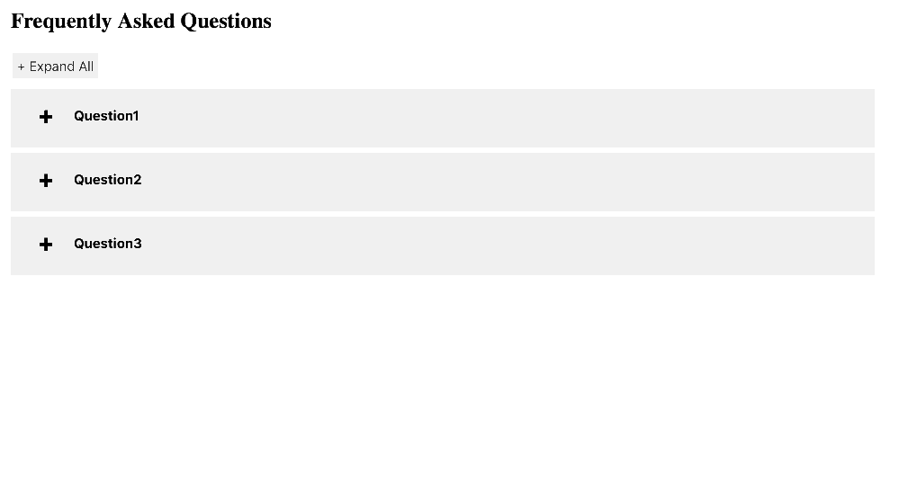

<!-- README.md is generated from README.Rmd. Please edit that file -->

# faq 

<!-- README.md is generated from README.Rmd. Please edit that file -->
[](https://cran.r-project.org/package=faq)
[](http://www.rdocumentation.org/packages/faq) 
[](https://cranlogs.r-pkg.org/badges/grand-total/faq)
<!-- badges: end -->

This is package is to create a FAQ (Frequently Asked Questions) page for
Shiny application with desired data.frame.

## Installation

from CRAN
``` r
install.packages("faq")
```
Dev version

``` r
devtools::install_github("jienagu/faq")
```

## Introduction

Simply create a data frame with `question` column and `answer` column.
Then put this data frame into `faq()` function, we will get a nice FAQ
page.

``` r
library(faq)
df <- data.frame(
  question = c("Question1", "Question2", "Question3"),
  answer = c("answer for question1", 
             "question2 answer", 
             "answer3")
)
faq::faq(data = df, elementId = "faq", faqtitle = "Frequently Asked Questions")
```


